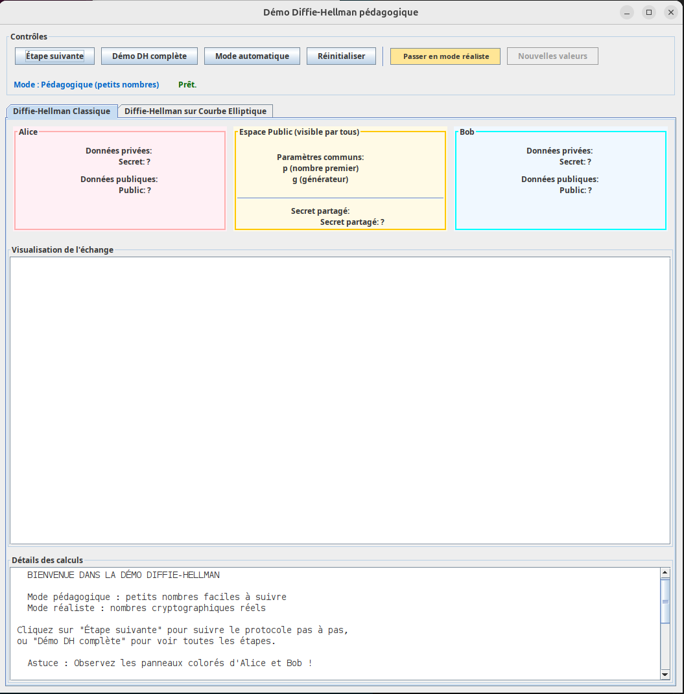
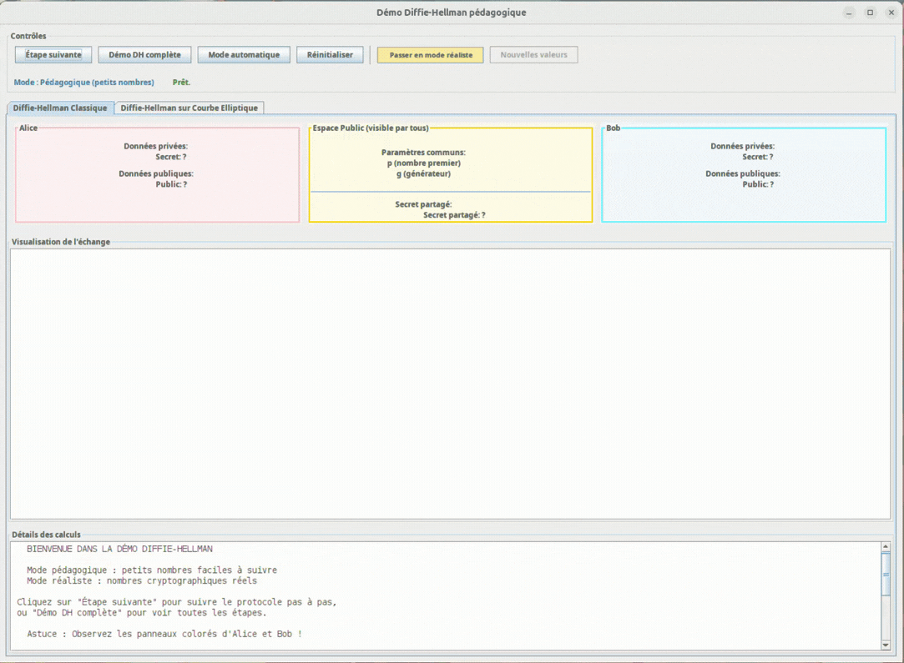
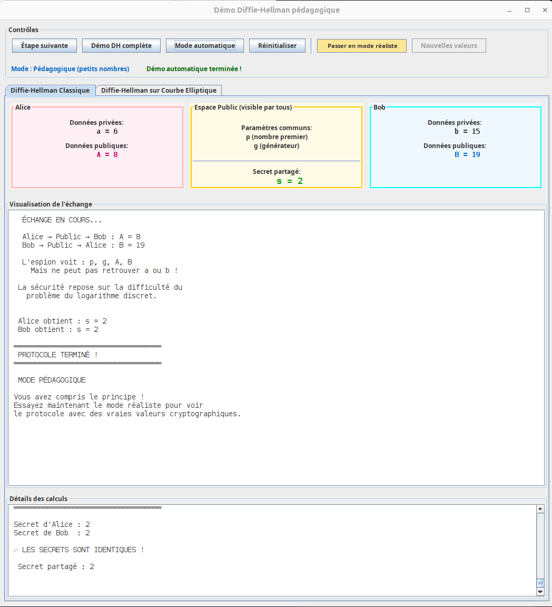
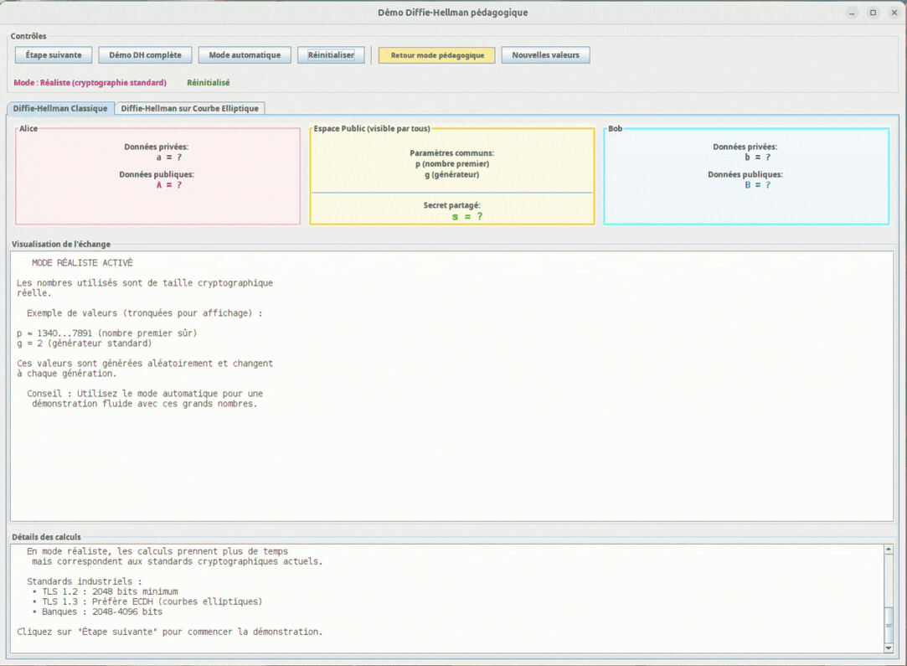
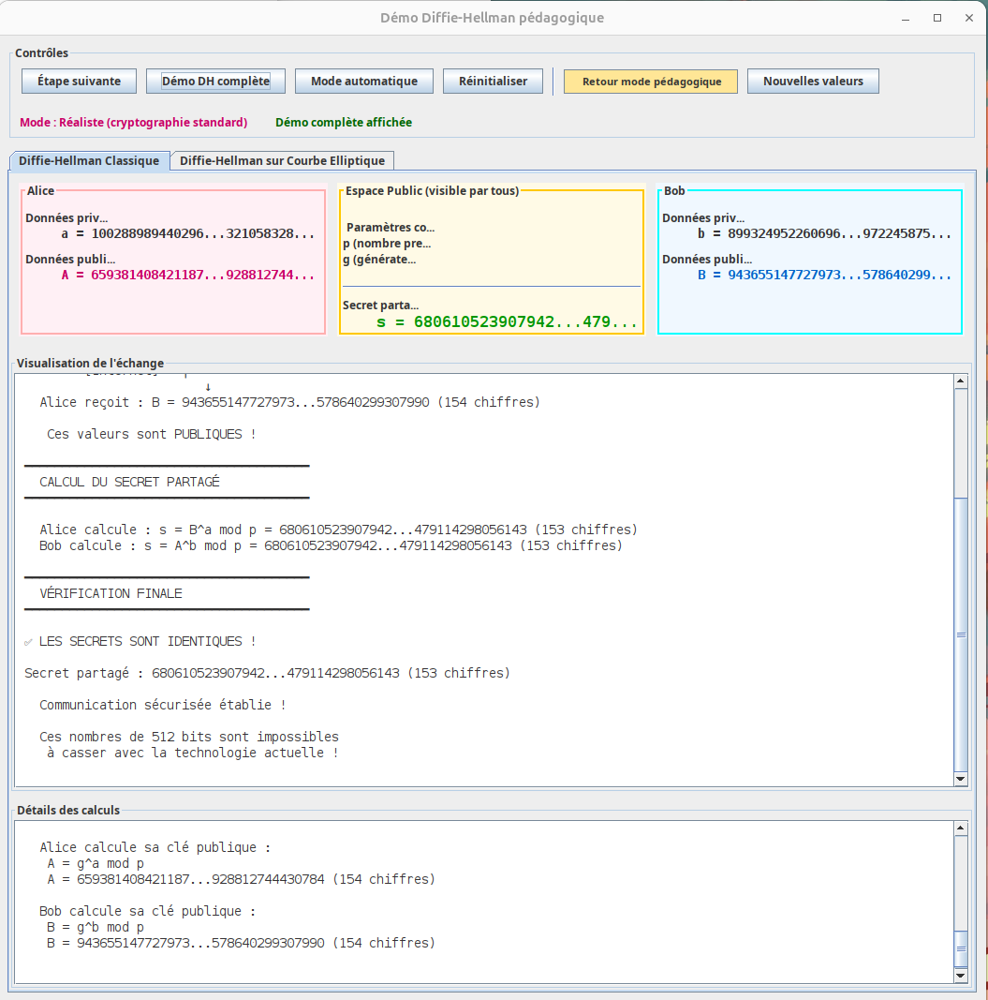
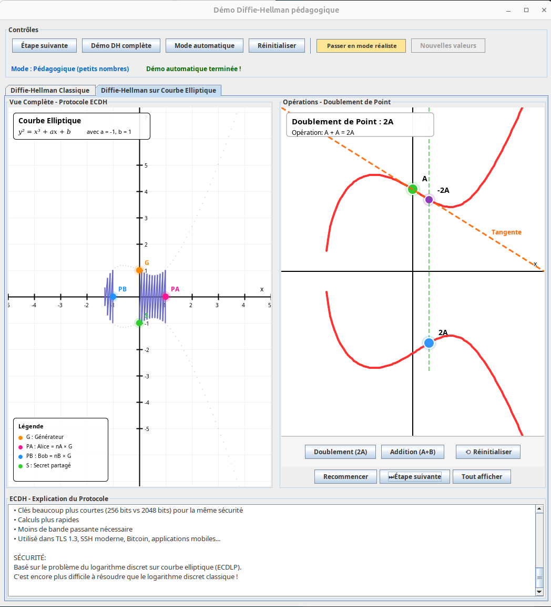

# Demonstrator-DH
**Démonstrateur pédagogique de l’échange de clés sécurisé basé sur les courbes elliptiques**


Ce démonstrateur est codé en **Java avec Swing** et propose une simulation des différentes étapes du protocole.

---

## Aperçu



Le démonstrateur permet :

- d'expliquer le fonctionnement de l'échange de clé de **Diffie-Hellman**
- voir les **calculs réalisés étape après étape**
- différencier une démonstration **pédagogique** et une démonstration **réaliste**
- visualiser les calculs intervenant sur **une courbe elliptique**

---

## Objectifs pédagogiques

Nous avons réalisé ce démonstrateur dans notre option de découverte d'un domaine de l'informatique.

Dans cette partie d'option **Cryptologie** nous avons essayé de proposer un démonstrateur pour pouvoir expliquer du mieux possible :

- le protocole de **Diffie-Hellman**
- l'échange asymétrique pour obtenir un secret partagé
- le fonctionnement de clé **publique** et clé **privée** pour obtenir le dudit secret
- l'intérêt des courbes elliptiques dans la recherche d'un secret difficilement inversible
- les étapes de calculs pour obtenir ce secret 

Le démonstrateur met en évidence les différentes étapes du protocole et affiche les valeurs intermédiaires afin de faciliter la compréhension.

---

# Moyens utilisés

- **Java**
- **Swing** – interface graphique
- **Ant** – système de build
- **Javadoc** – documentation

---

## Installation et exécution

Le projet utilise **Apache Ant** pour la compilation et l’exécution.

### Lancer le démonstrateur

```bash
ant
```
Cette commande va permettre de : 
1. Compiler le projet
2. Générer la javadoc
3. Lancer l'application

---

## Commandes Ant
Compiler le code :
```bash
ant compile
```
Générer la documentation du code :
```bash
ant javadoc
```
Exécuter le programme :
```bash
ant run
```
Nettoyer les fichiers de documentation et compiler :
```bash
ant clean
```

---

## Fonctionnement du démonstrateur

Le démonstrateur a deux modes possibles.

---

### Mode pédagogique

Ce mode par défaut utilise des **valeurs de petite taille** **fixées** afin de mieux expliquer les calculs :

- nombre premier p
- générateur g
- clés privées ***a*** et ***b***

## Exemple du mode pédagogique



## Résultat du mode pédagogique



---

### Mode réaliste

Ce mode utilise des **valeurs de grande taille** afin d'être le plus réaliste possible :

Les valeurs sont :
- des **nombres premier sûrs**
- de taille approchant les **78 bits**


## Exemple du mode réaliste



## Résultat du mode réaliste



---

### Modes d'exécution

Chaque démonstration peut être exécutée de trois manières :

#### Étape par étape

Exécuter chaque étape soit même. 
Chaque clic fait avancer le démonstrateur à l’étape suivante.
Le protocole complet comporte 9 étapes.

#### Démonstration complète

Les 9 étapes sont immédiatement exécutées.

#### Automatiquement

Les étapes sont exécutées automatiquement avec une pause ajustable entre chaque étape afin de suivre la progression.

---

### Visualisation des calculs

Le démonstrateur affiche :

- les différentes étapes du protocole

- les valeurs échangées

- le détail des calculs effectués

Une zone dédiée permet d’afficher ou de masquer les calculs détaillés.

#### Exemple de calcul sur une courbe elliptique



---

### Structure du projet

Comme nous le réalisons souvent en projet nous avons séparé le projet dans une logique MVC

```
src/
├─ model/        # Implémentation du modèle
├─ view/         # Interface graphique Swing
├─ controller/   # Logique de contrôle
build.xml         # Configuration Ant
```
--- 

#### Améliorations possibles
 
- améliorer la visualisation des opérations avec les courbes elliptiques
- rendre le démonstrateur plus interactif
- implémenter ou démontrer l'impact avec Eve en tant que **Man In The Middle**
- utiliser la clé calculée pour une discussion utilisant TLS entre les deux participant
 
---

# Auteurs
- Audrey **Le Basnier**
- Matthieu **Thomas** https://github.com/Matthieu-Thomas
- Basile **Tellier**
